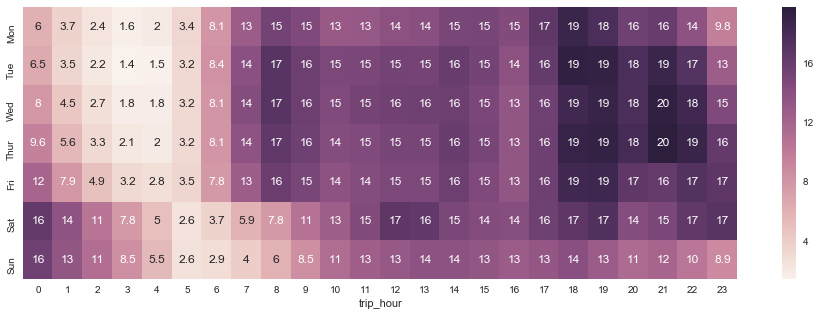
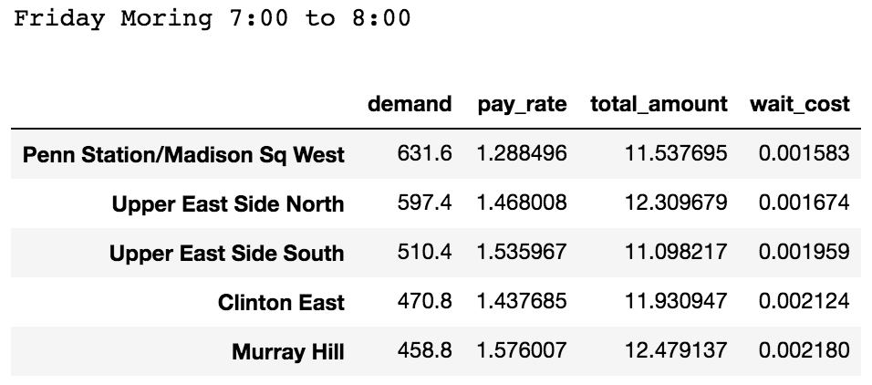
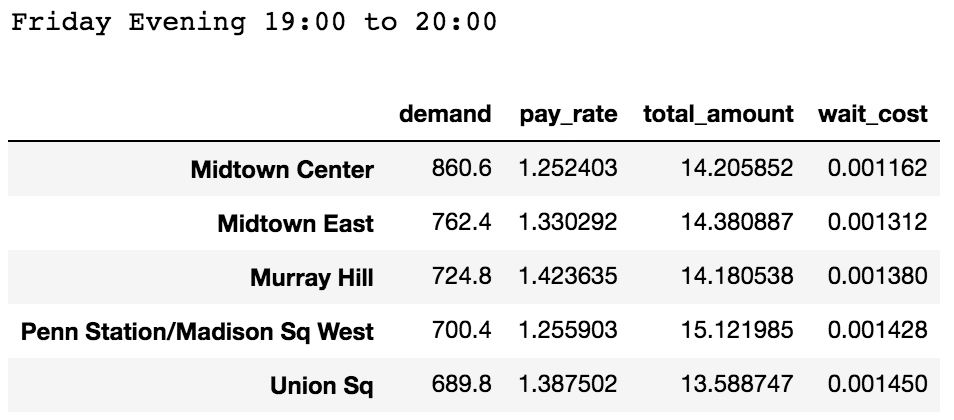
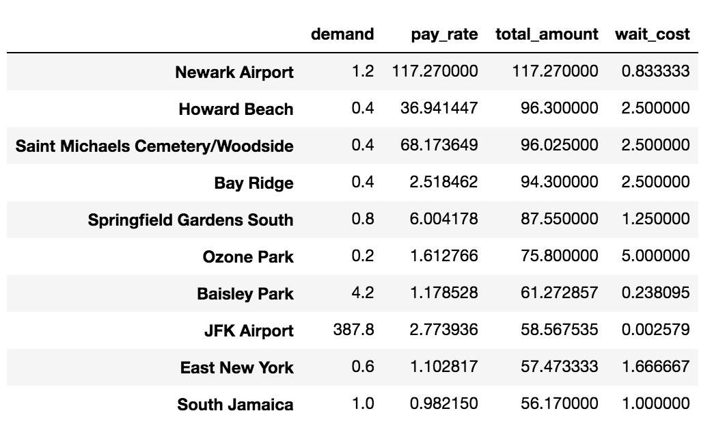

# NYC_Taxi_Data_EDA

Objective:  
Imagine that you decide to drive a taxi for 10 hours each week to earn a little extra money. Explain how you would approach maximizing your income as a taxi driver.
If you could enrich the dataset, what would you add?  Is there anything in the dataset that you don’t find especially useful?

Data:  
Yellow taxi data dictionary 
taxi zone lookup table

Notes:  
Yellow Medallion Taxicabs - These are the famous NYC yellow taxis that provide transportation exclusively through street-hails. The number of taxicabs is limited by a finite number of medallions issued by the TLC. You access this mode of transportation by standing in the street and hailing an available taxi with your hand. The pickups are not pre-arranged.

Solution assumptions:
1. As a taxi driver, I have pretty flexible hours as to when to drive.
2. I am driving a sedan, which means I could carry no more than 4 passengers at the same time.
3. I ignore any public holiday or city events in June.
4. I ignore city weather, which not available in our current data set.
5. I also ignore heavy traffic period, and I assume the time lost in traffic is compensated by the tariff.

In order to maximize income, two questions need to be answered:  
Q1. What is the best working schedule per week?  
Q2. During the my working hour, where should I head next after finishing each ride?

To answer the first question:  
I simply create a simple plot that count the everage hourly request per day (unit: 1k).

Based on this heatmap, the best time to work is during weekday evening. Although I have flexible hours, however, I prefer not to split 10 hours to many small intervals.   
At the same time, I would not want to continue working for more than 4 hours. As a result, my inital working schedule should look like these.  
- Tuesday or Friday from 18:00 to 20:00
- Wednesday and Thursday from 18:00 to 22:00

To answer the second question, for a given time, I need to rank all the locations in NYC according to the potential reward.
Then I will be able to make a decision on where should I drive with an empty car.
As a result, we can decouple this question into two sub questions.

Question 1: How do we quantify the reward of every single location for a given time?  
The final ranking of where the drive should go is based on the maximization of the following function:  
business_value/reward of target location = (expected_pay_rate + expected_total_pay - waiting_cost) / exp(distance to target location)  
Basically, the reward of target location is the linear combination of expected_pay_rate, expected_total_pay and waiting_cost, then the reward sum is discounted based on the distance between current location and the target location.  

For a given day of the week and time of the day, it is not hard to derive the expected total pay and expected pay rate from the transaction table.

The next question is find the waiting cost. We can assume that given a specific hour, the arrival of customers follows a Poisson process, with a constant arrival rate. Then the mean expceted waiting time can be estimated easily, since it follows an exponental distribution. Now the waiting cost can be computed as:  
waiting cost = the waiting time * time cost

Finally, we also want to factorize the distance between the target location and the current location into the reward function. Here I simply use exponential decay of the reward based on the distance simply borrowing some ideas from reinforcement learning.

# Now take friday evening as an example:

Analysis 1: The demand of each location changes through time:

Analysis 2: Airport has high expected total pay, but lower demand. (the high pay_rate is due to data error, there is a fixed pay for airport)

# What data to add?
- The first thing to add is weather data, such as perticipation, temperature, humidity and so forth.  
- The second thing to add is road construction, or real-time road condition.

# Is there anything in the dataset that you don’t find especially useful?
There are some data columns are not well recorded, such as drop time. Some columns have outliers.And some other columns are not useful in our analysis such as vendor ID.

# How to improve our model?
Our current model is a purely statistical model:  
- P(expected_reward|time,current_location,target_location) = conditional reward  
Then we rank our destination by the conditional reward  

However, if we have more data source such as weather, citi events, and oil price. It is not possible to have enough data to generate good estimate for these very sparse conditional probability.  
As a result, we will need to use machine learning algorithms so that we will find hidden correlations and generate good estimates.  
In other words, we will be building the following model:  
- f(time, current_location, target_location, weather, etc) = reward

Finally, we a demand heat map with geographic integration would be the most helpful, since I can drive towards a general busy area when the car is empty.

